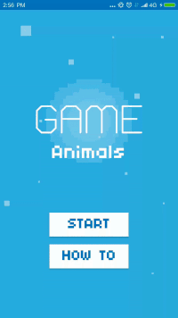

# Animals - Find me if you can



#### Modifications:

- How to use the application: that is always an important part which I find useful. Instead of having the "Exit" button, I changed it to "How To" and it shows a dialog to the user when pressed. Notice how the dialog is designed to call the how_to_play layout file. Further design could be achieved in this way, but I just kept it with the dummy lorem text. 
- While playing the game, I noticed that the first four images were always the same and so was the picture of the animal to find. I changed that so the application changes the images and the animal to find each time we start the application.
- Instead of using Buttons for the views that display the pictures to find, I find it appropriate to use ImageButtons.
- Owning a device that has more than one demo application, I find it convenient to have an unique application icon for each app I make. Not feeling creative and just for a demo purpose, I changed the icon of this application to be the picture of the draft wire frame of the application. 
- Not wanting the user to have the application rotate in landscape mode, I set the screenOrientation to portrait. 
- To interact with the user, I make use of the vibrator if the device has one. Whenever the user selects the wrong picture, the device should vibrate.
- Package name: May be not a must in this case,  but I also changed the package name. It is good to note here that we are now allowed to release an application in most application stores  if the app package name is "com.example".
- Method names: I always have this idea in mind that the source code is designed for humans to read, not only for the computers to interpret. With that in mind, I like using mnemonic, names that are designed to aide the brain and the memory about what a given method should do.
 
 Before:
 
 ```java
     public void btnClick(View view) {
         //to do when the button is clicked
         startActivity(new Intent(MainActivity.this, PlayActivity.class));
     }
     public void btnClick2(View view) {
         //to do when the button is clicked
         MainActivity.this.finish();
 }
 ```
 
 After:
 
 ```java
  public void btnStart(View view) {
         //to do when the button is clicked
         startActivity(new Intent(MainActivity.this, PlayActivity.class));
     }
 
     public void btnHowTo(View view) {
         //to do when the button is clicked
         hoToPlay();
     }
 ```
 
- Copy paste snippets: I found that the "PlayActivity" had too much copy pasted code which will make the application hard to maintain. I restructured the code and started an attempt into removing unnecessary code redundancy.
- To improve the usability of the application, if find it important to inform the user when the selected picture does not much the name of the animal to find that is displayed. I generated the white and black version of all the pictures, then use them to further inform the user when the selected picture was not the right one.
- Still about the usability, I use an animation to the views whenever I feel the need. For that, I created "shake.xml" which is placed inside the "/res/anim/" folder. 

```xml
<set xmlns:android="http://schemas.android.com/apk/res/android">
    <rotate
        android:duration="70"
        android:fromDegrees="-5"
        android:interpolator="@android:anim/linear_interpolator"
        android:pivotX="50%"
        android:pivotY="50%"
        android:repeatCount="5"
        android:repeatMode="reverse"
        android:toDegrees="5" />
    <translate
        android:duration="70"
        android:fromXDelta="-10"
        android:interpolator="@android:anim/linear_interpolator"
        android:repeatCount="5"
        android:repeatMode="reverse"
        android:toXDelta="10" />
</set>
```

Additionally, I created the Animations class, which enables me to easily use my animations if I ever decide to have different types later. 

```java
public class Animations extends AppCompatActivity{

    protected  void shake(Context context, View viewToAnimate){
        final Animation animShake = AnimationUtils.loadAnimation(context, R.anim.shake);
        viewToAnimate.startAnimation(animShake);
    }
}

```
Now, I can easily use it like this

```java
        new Animations().shake(this, view);
```
- While testing the application, I stumbled and unwilling pressed the back button, which always gets me back to the activity that that present two button "Start" or "Exit". I added a method to override the "onBackPressed()" to show a confirmation dialog to the user when the back press is pressed.
 
 ```java
 @Override
     public void onBackPressed() {
         // 1. Instantiate an AlertDialog.Builder with its constructor
         AlertDialog.Builder builder = new AlertDialog.Builder(this, R.style.AppThemeDialog);
 
 
         // 2. Set an icon, in this case, we use the animal to find as the icon
         builder.setIcon(arrayDrawableImagesIDs[imageIdNotToUseAgain.get(indexOfTheAnimalNameToFindInImageNotUsedAgain)]);
 
         // 3. Chain together various setter methods to set the dialog characteristics
         builder.setMessage("Do you want to exit the game?")
                 .setTitle(getTitle());
 
         // 4. Add the buttons
         builder.setPositiveButton("Yes", new DialogInterface.OnClickListener() {
             public void onClick(DialogInterface dialog, int id) {
                 // User clicked OK button, end the App
                 finishAffinity();
             }
         });
         builder.setNegativeButton("Cancel", new DialogInterface.OnClickListener() {
             public void onClick(DialogInterface dialog, int id) {
                 // User clicked NO, cancel the dialog
                 dialog.cancel();
             }
         });
 ```
 

- The used images in the drawable folder were of 48 by 48px. The images looked stretched when getting enlarge to fit the size the views. I replaced them with 96 by 96 version of the images.


